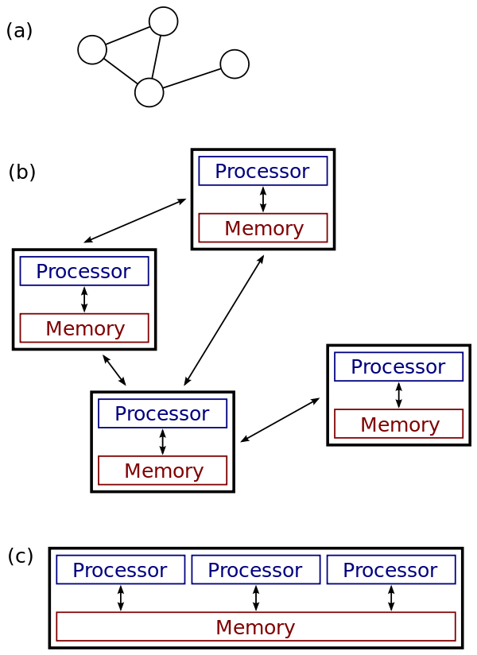
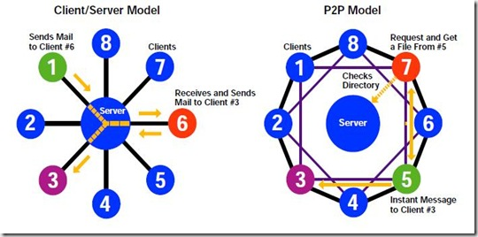
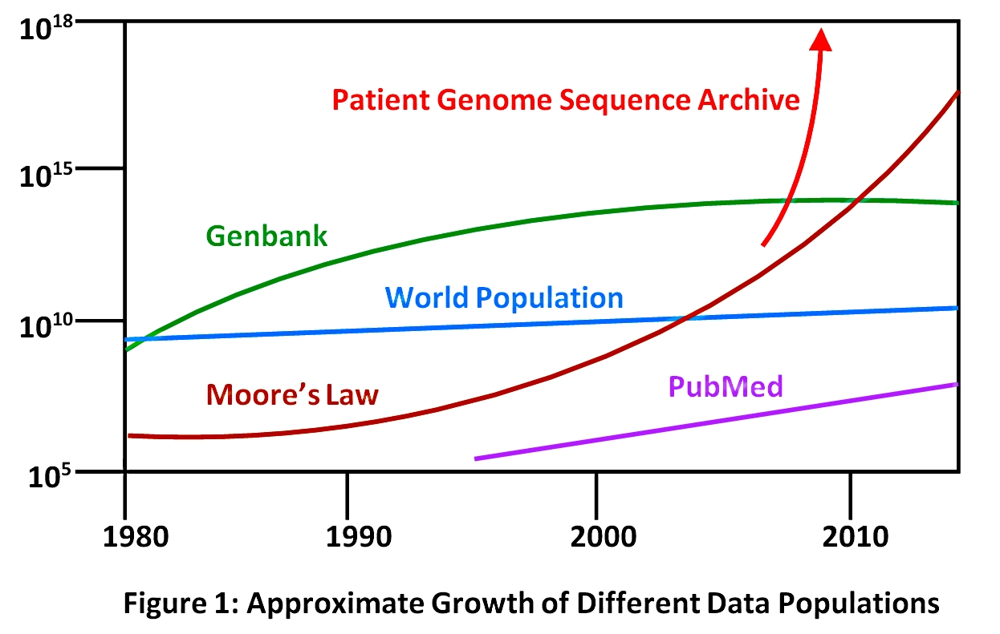
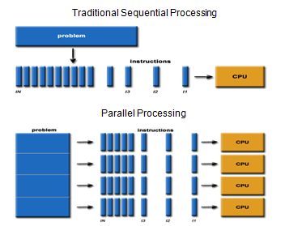
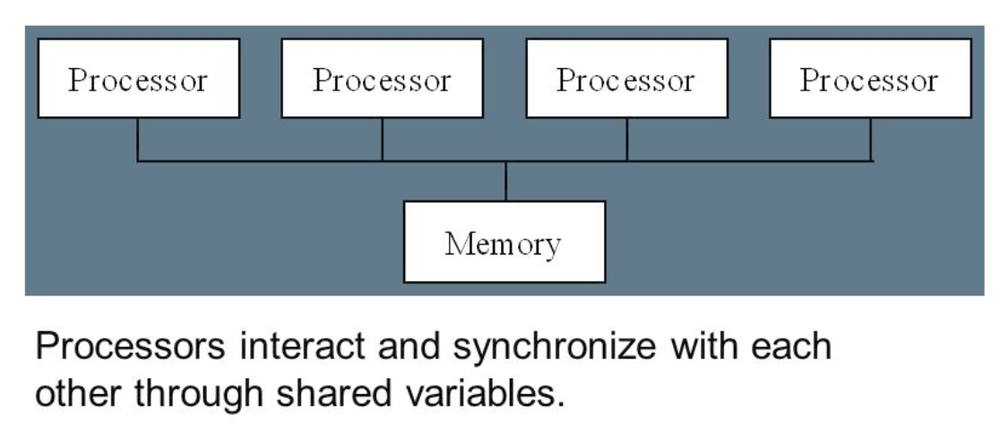
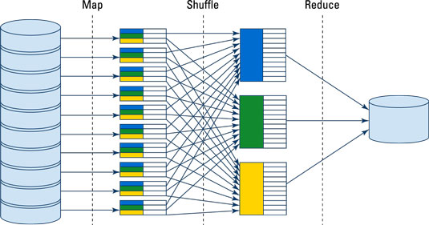
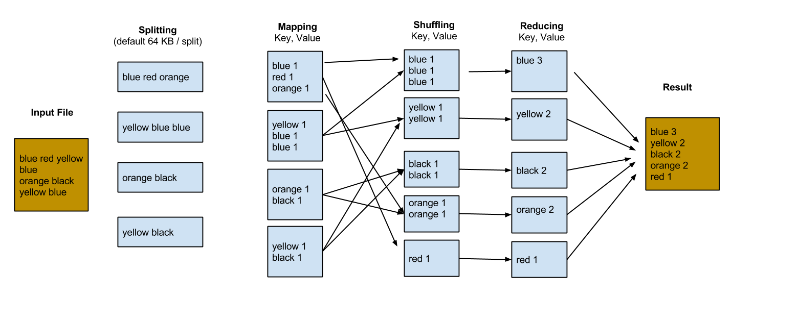

# Parallel and Distributed Computing with MapReduce

## Introduction 

MapReduce a programming paradigm that enables scalability across hundreds or thousands of servers for big data analytics. The underlying concept can be somewhat difficult to grasp, because this paradigm differs from the traditional programming practices. This lesson aims to present a simple yet intuitive account of MapReduce that we shall put into practice in upcoming labs. 

*In a nutshell, the term "MapReduce" refers to two distinct tasks. The first is the __Map__ job, which takes one set of data and transforms it into another set of data, where individual elements are broken down into tuples __(key/value pairs)__, while the __Reduce__ job takes the output from a map as input and combines those data tuples into a smaller set of tuples.*

Let's see this with help of some simple examples in this lesson.

## Objectives
You will be able to:
- Understand distributed and parallel computing environments
- Explain how MapReduce differs from traditional programming approaches
- Understand how MapReduce works using a simple word count example. 

## Parallel and Distributed Processing

The MapReduce programming paradigm is designed to allow __Parallel and Distributed Processing__  of large sets of data that classify as Big Data. MapReduce allows us to convert such big datasets into sets of __Tuples__ as __key:value__ pairs, as we'll see shortly. These pairs are analogous to the data structure we saw with dictionaries and JSON files etc. These tuples are __combined__ and __reduced__ under in a computational environment to allow distributed execution of complex tasks on a group (cluster) of interconnected computers. 

So in simpler terms, _MapReduce use parallel distributed computing to turn big data into regular data._

Let's first see what we mean by parallel and distributed processing below

### Distributed Processing Systems

>A distributed system is a network of computers that communicate with each other in order to achieve a unified goal. 

The computers in a distributed system are independent and do not physically share physical memory or processors. They communicate with each other as messages, transferred from one computer to another over a network. The computers in such an environment are normally referred to as __nodes__ of that network. Messages between nodes can communicate many things: 

- Computers communicate among themselves to execute computing procedures with given conditions 
- Computers send and receive actual packets of data
- Computers send signals that tell other nodes to behave a certain way . etc. 

The terms "concurrent computing", "parallel computing", and "distributed computing" have a lot of overlap, and no clear distinction exists between them. The same system may be characterized both as "parallel" and "distributed"; the processors in a typical distributed system often run concurrently, in parallel.  


In the image below , a and b are examples of distributed networks having own memory and processing abilities. In c, memory is shared between processors to run real time , parallel execution of required tasks on multiple processors.  




Nodes(i.e. processors shown above) in a distributed system can have different roles. This role depends on the goal of the system and the a node's own hardware and software properties. There are two predominant ways of organizing computers in a distributed system. The first is the __client-server architecture__, and the second is the __peer-to-peer architecture__. 




We know from earlier lessons that client server architecture operates by allowing client to make requests for communication/data to the server, which in turns accepts or rejects these requests. In a peer to peer system, (think about file sharing systems like Bit Torrents etc), all connected computers can communicate freely with each other without requiring any approval from a server. [Here](https://www.techrepublic.com/article/understanding-the-differences-between-client-server-and-peer-to-peer-networks/) is a great article highlighting the differences between two approaches. 

### Parallel Processing Systems

>Parallel distributed processing refers to a powerful framework where mass volumes of data are processed very quickly by distributing processing tasks across __clusters__ of computers. 

Consider the world famous [Moore's law](https://en.wikipedia.org/wiki/Moore%27s_law) and how computational speeds have grown in past 50 years or so. Despite this explosion in speed, computers today still aren't able to keep up with the scale of Big Data. Let's take the example of gene sequencing technology in in the field of Genomics. This technology will make higher amounts of gene-sequence data available more quickly. The required speed required to process this data will become becoming much higher  __than__ the rate at which processors are getting faster according to Moore's Law. This is shown in the image below.



In other words, for genetic analytical experiments, computers are become less and less able to cope with the scale of processing problems each year, __even though the computers themselves are getting faster__.

#### Multi-Processor Architectures

Individual processors, however fast they get, will always have physical and mechanical constraints on speed and storage looking at the chart above. An obvious solution that the technology world is turning to is using __Multiple Processors__. If two, or three, or more processors are available, then many programs can be executed more quickly in a distributed environment as mentioned earlier. While one processor (a node) is doing one aspect of some computation, other nodes can work on another. *All of them can share the same data, but the task will proceed __in parallel.__*. A comparison between sequential (traditional processing on a single processor) and parallel processing is shown in the image below:



In order to be able to work together, multiple processors need to be able to share information with each other. This is by a distributed environment system like Hadoop or Spark. The role of a processor in parallel computation is to carry out the evaluation and execution rules of a specified programming language. 

*As compared to the __Message Passing Model__ for distributed environments we described earlier, there is also a __Shared Memory Model__ for parallel processing where different processes may execute different statements, but any statement can affect the shared environment.*



## So What is MapReduce ?

> __MapReduce__ is a software framework developed for processing datasets that qualify as "Big Data", in a __parallel and distributed__ procesing environment over several computers/nodes connected to each other as part of a __cluster__. 

The key idea behind MapReduce is __mapping__ large datasets in a collection of key,value pairs, and then __reducing__ all pairs with the same key. So the connected nodes are either __Mappers__ or __Reducers__ according to the task allocated to them by a dedicated __Master__, which in simplest of terms is responsible for task allocation, fault tolerance and other control tasks.  

This may sound a bit counter intuitive at the beginning, but we shall soon look into a simple (standard) example that is shown to introduce MapReduce, i.e, __The Word Count Problem__. The overall concept of MapReduce is very simple yet very powerful as:
- Somehow, all data can be mapped to <kay:value> pairs. Yes, ALL data. 
- Keys and Values themselves can be of ANY data type.

### MapReduce Workflow

The MapReduce workflow involves creating map and reduce tasks as mentioned above. Let's look at these in a bit more detail here. 

### MAP Task ((Splitting & Mapping)

The dataset that needs processing must first be transformed into <key:value> pairs and split into fragments, which are then assigned to map tasks. Each computing cluster is assigned a number of map tasks, which are subsequently distributed among its nodes.

> A Computing Cluster a group of nodes that are connected to each other and perform a shared computing task. 

After processing of the original key:value pairs, some __intermediate__ key:value pairs are generated. The intermediate key:value pairs are __sorted by their key values__ to create a new list of key:value pairs. 

### REDUCE Task (Shuffling, Reducing)

This list from map task is divided into a new set of fragments. __Number these new fragments, will be the same as the number of the reduce tasks__. Every reduce task has a fragment assigned to it. The reduce task simply processes the fragment and produces an output, which is also a key:value pair. Reduce tasks may also be distributed among the different nodes of the cluster. After the task is completed, the final output is written onto a file system. The underlying file system is usually HDFS (Hadoop file system). 


We can efficiently break down and begin to make sense of a huge volume, velocity, and variety of data by using map and reduce tasks as shown above. A general diagram of the MapReduce architecture is shown below:



The complete execution process (execution of Map and Reduce tasks, both) is controlled by two types of entities called a

__Jobtracker__ : Acts like a master (responsible for complete execution of submitted job)

__Multiple Task Trackers__ : Act like slaves, each of them performing the job


### The Word Count problem
Map-Reduce paradigm is quite different than traditional programming paradigms as you can probably tell by now. Let's look at a classical example of "word count" from the days of Unix systems, https://en.wikipedia.org/wiki/Wc_(Unix), which counts how often words appear in a documents. In a MapReduce environment, the solution will requires one map-reduce job. More complex tasks might need more jobs. Here we shall keep it simple, as shown in the image below, where we are trying a count how many times each word appears in the given document. This toy example can be mapped on to analyzing terabytes of text in a digital library. 



A brief description of each phase: 

1. __Split__: Split the input data in a number of fragments according to size defined during configuration. (In hadoop file system "HDFS" the default block size is 64KB, whih can be changed if required). 

2. __Mapper__ : Each mapper processes a individual fragment rather than considering the whole document. A fragment only contains part of the document. In map phase we __tokenize__ words in each line of the given fragment as a  <Key,Value> pair. We set each token , we set `key = word`, and assign to this key  `value = 1`.

3. __Shuffler__ : A shuffler (also called a __combiner__) sorts __all similar keys together__, to be passed to the reducer later.

4. __Reducer__:  A Reducer process each sorted split. In words count example, reducer calculate the number of word occurrences based on the given value. 

We shall soon look at programming this simple example in an emulated SPARK environment. Meanwhile, [have at look at this article](https://www.edureka.co/blog/mapreduce-tutorial/) to see read about the in a bit more detail. In essence: 

> A MapReduce program is defined by at least two functions, creating 3 sets of key:value pairs:

> map : **(k1, v1) −→ [(k2, v2)]**

> reduce : **(k2, [v2]) −→ [(k3, v3)]**

A general pseudocode for a word count map and reduce tasks would look like 

```python
# Count word frequency
def map( doc ) :
    for word in doc.split( ' ' ) :
    emit ( word , 1 )

def reduce( key , values ) :
    emit ( key , sum( values ) )
```

Similarly, we can discuss several Map-Reduce jobs in order to complete a given task. This means that once a first MapReduce job is finish, the output will become an input for the second MapReduce job and the output could be the final result ( or fed into another job). 

Let's assume that we would like to extend the word count program and we would like to count all words in a given Twitter dataset. The first MapReduce will read our twitter data and extract the tweets text. The second MapReduce is the word count Map-Red which analyze twitter and produce the statistics about it. So it is simply chaining together multiple jobs. 

> __InputFile -> Map-1 -> Reduce1 -> output1 -> Map2 - > Reduce-2 -> output2 -> ....Map-x__


Next, We shall look briefly at Hadoop, distributed processing framework built on MapReduce Programming paradigm and also Apache Spark, which adds extra features of security and fault tolerance to it's MapReduce offering, making it an industry standard. We shall also look at programming for the above mentioned word count problem.

## Additional Resources

Visit following external links to read about above descriptions and example in more detail. 

- [MapReduce Introduction](https://www.tutorialspoint.com/map_reduce/map_reduce_introduction.htm)

- [What is MapReduce? How it Works](https://www.guru99.com/introduction-to-mapreduce.html)

## Summary 

In this lesson, we looked at How MapReduce allows a programming paradign, quite different than traditional programming practices, yet very powerful and effective towards processing large amounts of data. Next we shall look at Spark programming environment and some coding exercises to get grips with PySpark programming. 
